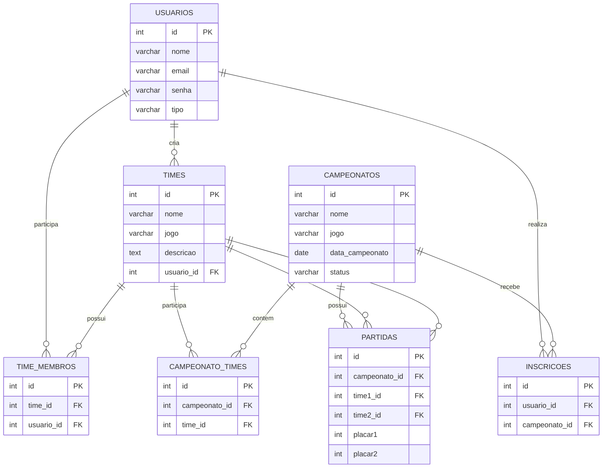

# 🎮 ProLeague

## Plataforma de Campeonatos de Jogos

O **ProLeague** é uma plataforma web desenvolvida para gerenciamento de campeonatos de jogos eletrônicos. O sistema permite que usuários criem contas, formem times, participem de campeonatos e acompanhem partidas e rankings.

O projeto foi desenvolvido com foco em organização, responsividade e um visual gamer moderno.

---

# 🚀 Tecnologias Utilizadas

- **PHP**
- **HTML5**
- **CSS3**
- **JavaScript**
- **PostgreSQL**

---

# 🎯 Objetivo do Projeto

O objetivo do ProLeague é oferecer uma plataforma simples para:

- Cadastro e login de usuários;
- Criação e gerenciamento de times;
- Inscrição em campeonatos;
- Controle de partidas;
- Área administrativa para gerenciamento do sistema;
- Aplicação prática de CRUD e banco de dados relacional.

---

# ⚙️ Funcionalidades

### 👤 Usuários

- Cadastro de conta;
- Login e logout;
- Diferenciação entre usuário comum e administrador.

### 👥 Times

- Criação de times;
- Edição das informações do time;
- Associação de jogadores ao time.

### 🏆 Campeonatos

- Listagem dos campeonatos disponíveis;
- Inscrição em eventos;
- Controle de status dos campeonatos.

### ⚔️ Partidas

- Cadastro de confrontos;
- Registro dos placares;
- Associação das partidas aos campeonatos.

### 🔧 Área Administrativa

- Gerenciamento dos campeonatos;
- Controle das partidas;
- Administração do sistema.

---

# 📂 Estrutura do Projeto

```text
proleague/
│
├── index.php
├── home.php
├── login.php
├── cadastro.php
├── logout.php
│
├── campeonatos/
│   ├── campeonatos.php
│   ├── inscrever_campeonato.php
│   ├── editar_campeonato.php
│   └── excluir_campeonato.php
│
├── partidas/
│   ├── partidas.php
│   ├── editar_partida.php
│   └── excluir_partida.php
│
├── times/
│   ├── times.php
│   ├── editar_time.php
│   └── excluir_time.php
│
├── admin/
│   ├── admin_inscritos.php
│   └── gestao_usuarios.php
│
├── usuario/
│   └── minhas_inscricoes.php
│
├── includes/
│   ├── conexao.php
│   ├── header.php
│   ├── footer.php
│   ├── navbar.php
│   └── funcoes.php
│
├── css/
│   ├── style.css
│   ├── home.css
│   ├── campeonatos.css
│   └── admin.css
│
├── js/
│   ├── script.js
│   └── theme.js
│
├── img/
│   ├── logo.png
│   ├── banners/
│   └── icones/
│
├── database/
│   └── proleagueBD.pgsql
│
├── docs/
│   └── Plataforma de campeonatos de jogos.txt
│
└── README.md
```

---

# 🗄️ Banco de Dados

O sistema utiliza **PostgreSQL** para armazenar todas as informações da plataforma.

---

# 📊 Diagrama do Banco de Dados



---

## Tabela `usuarios`

Responsável por armazenar os dados dos usuários cadastrados.

| Campo | Descrição |
|---------|-----------|
| id | Identificador do usuário |
| nome | Nome do usuário |
| email | Email utilizado para login |
| senha | Senha criptografada |
| tipo | Define se é administrador ou usuário comum |

---

## Tabela `times`

Armazena os times criados pelos usuários.

| Campo | Descrição |
|---------|-----------|
| id | Identificador do time |
| nome | Nome do time |
| jogo | Jogo principal do time |
| descricao | Informações sobre o time |
| usuario_id | Usuário responsável pelo time |

---

## Tabela `campeonatos`

Guarda os campeonatos cadastrados na plataforma.

| Campo | Descrição |
|---------|-----------|
| id | Identificador do campeonato |
| nome | Nome do campeonato |
| jogo | Jogo relacionado |
| data_campeonato | Data do evento |
| status | Situação atual do campeonato |

---

## Tabela `partidas`

Responsável pelo controle dos confrontos entre os times.

| Campo | Descrição |
|---------|-----------|
| id | Identificador da partida |
| campeonato_id | Campeonato ao qual pertence |
| time1_id | Primeiro time |
| time2_id | Segundo time |
| placar1 | Pontuação do time 1 |
| placar2 | Pontuação do time 2 |

---

## Tabela `inscricoes`

Relaciona usuários aos campeonatos em que estão inscritos.

| Campo | Descrição |
|---------|-----------|
| id | Identificador da inscrição |
| usuario_id | Usuário inscrito |
| campeonato_id | Campeonato escolhido |

---

## Tabela `campeonato_times`

Tabela intermediária que relaciona os times aos campeonatos.

Ela permite que vários times participem de um mesmo campeonato.

---

## Tabela `time_membros`

Armazena os jogadores pertencentes a cada time.

Essa tabela cria a relação entre usuários e equipes.

---

# 🎨 Interface

O sistema possui:

- Tema escuro;
- Estilo gamer com cores neon;
- Layout responsivo;
- Compatibilidade com computadores e dispositivos móveis.

---

# 📚 Conceitos Aplicados

- CRUD completo;
- Sessões em PHP;
- Login e autenticação;
- Relacionamentos entre tabelas;
- Chaves primárias e estrangeiras;
- PostgreSQL;
- Organização de projeto web.

---

# ⚙️ Configuração

## Requisitos

Para executar o projeto é necessário possuir:

- PHP 7.4 ou superior;
- PostgreSQL 13 ou superior;
- pgAdmin 4;
- Navegador Web;
- VS Code (opcional).

---

## Configuração do Banco de Dados

O projeto já possui um script completo do banco de dados.

Arquivo:

```text
database/proleagueBD.pgsql
```

### Passo a Passo

#### 1. Abra o pgAdmin

Inicie o PostgreSQL e abra o pgAdmin.

#### 2. Crie um banco de dados

Clique com o botão direito em **Databases → Create → Database**.

Nome sugerido:

```text
proleague
```

#### 3. Selecione o banco criado

Clique sobre o banco recém-criado.

#### 4. Abra a Query Tool

```text
Tools → Query Tool
```

#### 5. Abra o arquivo do banco

Selecione:

```text
database/proleagueBD.pgsql
```

#### 6. Execute o script

Pressione:

```text
F5
```

ou clique em **Execute (▶)**.

Após a execução, todas as tabelas, relacionamentos e dados iniciais serão criados automaticamente.

---

# 🚀 Como Executar

### Clone o repositório

```bash
git clone https://github.com/seu-usuario/proleague.git
```

### Entre na pasta do projeto

```bash
cd proleague
```

### Inicie o servidor PHP

```bash
php -S localhost:8000
```

### Acesse no navegador

```text
http://localhost:8000
```

---

# 🚀 Acesso Administrador

O sistema já possui um usuário administrador cadastrado no banco de dados.

Após restaurar o banco, utilize as seguintes credenciais para acessar a área administrativa:

### Credenciais

```text
E-mail: admin@proleague.com
Senha: admin123
```

Este usuário possui acesso às funcionalidades administrativas do ProLeague, como:

- Gerenciamento de usuários;
- Gerenciamento de campeonatos;
- Gerenciamento de partidas.

> As credenciais foram disponibilizadas apenas para fins acadêmicos e testes.

---

# 📦 Testando o Dump do PostgreSQL

Este guia mostra como restaurar e testar o arquivo de backup do banco de dados PostgreSQL.

## Pré-requisitos

- PostgreSQL instalado;
- Usuário `postgres` configurado;
- Arquivo de backup `proleague_backup.sql` salvo em:

```text
H:\php_final\proleague_backup.sql
```

---

## 1. Criar um banco de dados de teste

Abra o Prompt de Comando e execute:

```bash
createdb -U postgres proleague_teste
```

Digite a senha do usuário `postgres`.

Caso apareça:

```text
database "proleague_teste" already exists
```

significa que o banco já existe e você pode continuar normalmente.

---

## 2. Restaurar o arquivo de backup

Execute:

```bash
psql -U postgres -d proleague_teste -f "H:\php_final\proleague_backup.sql"
```

Digite novamente a senha do usuário `postgres`.

Se a restauração for concluída com sucesso, aparecerão mensagens semelhantes a:

```text
CREATE TABLE
COPY
ALTER TABLE
ALTER SEQUENCE
```

---

## 3. Entrar no banco restaurado

Execute:

```bash
psql -U postgres -d proleague_teste
```

Digite a senha do usuário `postgres`.

---

## 4. Verificar se as tabelas foram importadas

Dentro do PostgreSQL, execute:

```sql
\dt
```

Deverão aparecer tabelas como:

- campeonato_times
- campeonatos
- inscricoes
- partidas
- time_membros
- times
- usuarios

---

## 5. Verificar os dados importados

Listar todos os usuários:

```sql
SELECT * FROM usuarios;
```

Listar todos os campeonatos:

```sql
SELECT * FROM campeonatos;
```

Listar todos os times:

```sql
SELECT * FROM times;
```

Se os registros aparecerem, o backup foi restaurado corretamente.

---

## 6. Testar inserção de novos dados

Execute:

```sql
INSERT INTO usuarios(nome, email, senha)
VALUES ('teste', 'teste@email.com', '123');
```

Depois confira:

```sql
SELECT * FROM usuarios;
```

Se o novo usuário aparecer na consulta, significa que as tabelas e as sequências foram restauradas corretamente.

---

## 7. Sair do PostgreSQL

```sql
\q
```

---

## Resumo dos comandos utilizados

Criar banco:

```bash
createdb -U postgres proleague_teste
```

Restaurar backup:

```bash
psql -U postgres -d proleague_teste -f "H:\php_final\proleague_backup.sql"
```

Entrar no banco:

```bash
psql -U postgres -d proleague_teste
```

Listar tabelas:

```sql
\dt
```

Consultar usuários:

```sql
SELECT * FROM usuarios;
```

Sair do PostgreSQL:

```sql
\q
```

# 🎨 Protótipo no Figma

Link do protótipo:

```text
https://www.figma.com/make/DGSvGy9JlUjtW6k23lvWuj/Prototipar-p%C3%A1ginas-existentes?t=liNuistmdgtS7ZKb-20&fullscreen=1&preview-route=%2Finicio
```

---

# 🔮 Melhorias Futuras

- Upload de logo dos times;
- Sistema de chaveamento automático;
- Ranking avançado;
- Estatísticas dos jogadores;
- Painel administrativo mais completo;
- Upload de imagens dos usuários;
- Sistema de notificações.

---

# ✅ Funcionalidades Implementadas

- Cadastro de usuários;
- Login e logout;
- Controle de acesso por perfil;
- CRUD de campeonatos;
- CRUD de partidas;
- CRUD de times;
- Inscrição em campeonatos;
- Associação entre usuários e equipes;
- Gerenciamento administrativo;
- Relacionamentos PostgreSQL;
- Sessões PHP;
- Interface responsiva;
- Tema gamer personalizado.

---

# ⚠️ Restrições do Sistema

- Não possui integração com APIs externas;
- Não possui aplicativo mobile;
- Não possui sistema de pagamentos;
- Não possui envio de e-mails automáticos;
- Executado localmente para fins acadêmicos.

---

# 👨‍💻 Desenvolvedor

Projeto desenvolvido para fins acadêmicos e prática de desenvolvimento web utilizando PHP e PostgreSQL.

**ProLeague - Plataforma de Campeonatos Gamer**
